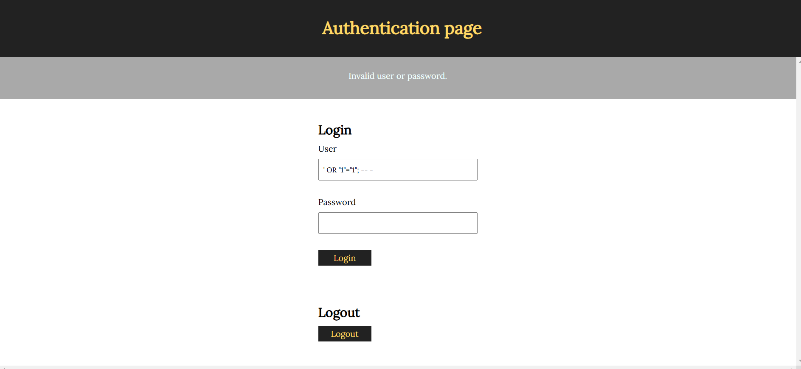
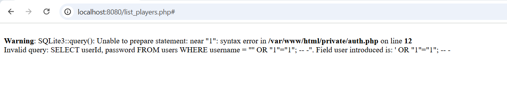
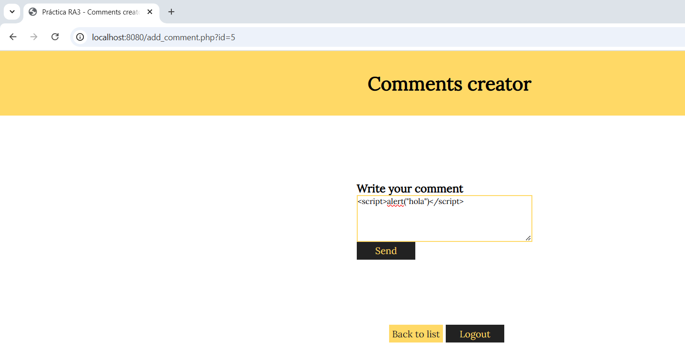
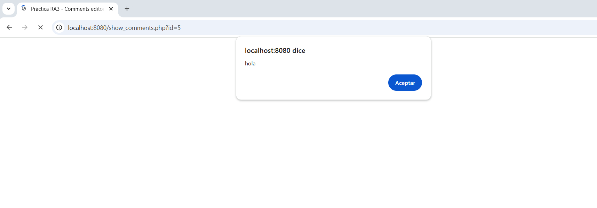
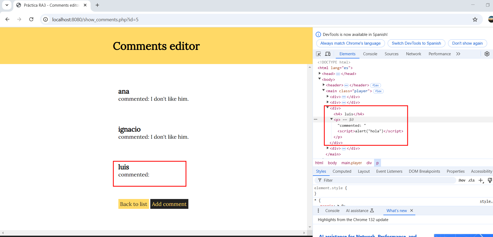
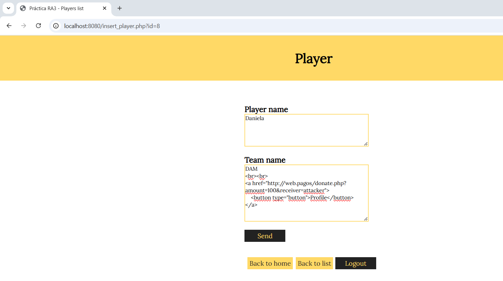
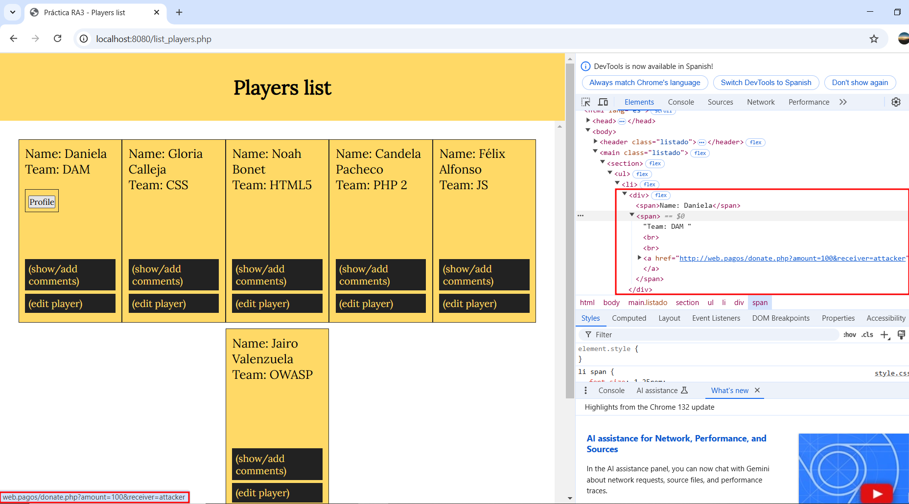

## Índice

1. [Declaración de confidencialidad](#declaración-de-confidencialidad)
2. [Descargo de responsabilidad](#descargo-de-responsabilidad)
3. [Información de contacto](#información-de-contacto)
4. [Índices de gravedad de los hallazgos](#índices-de-gravedad-de-los-hallazgos)
5. [Alcance](#alcance)
6. [Resumen ejecutivo](#resumen-ejecutivo)
7. [Resumen e informe de vulnerabilidades](#resumen-e-informe-de-vulnerabilidades)
8. [Resultados técnicos](#resultados-técnicos)
9. [Conclusión](#conclusión)

---
## Declaración de confidencialidad
El acceso al presente documento estará autorizado únicamente a la empresa “Talent ScoutTech”, así como a los integrantes de “Gades Security”, ya que contiene información confidencial y sensible. Quedará así mismo prohibida la reproducción de cualquier tipo y la distribución a terceros por cualquier medio sin consentimiento expreso de las empresas autorizadas antes mencionadas.

## Descargo de responsabilidad
Tras haber realizado el análisis de la aplicación web proporcionada por “Talent ScoutTech” y con este informe como prueba de su realización junto a recomendaciones para arreglar o mejorar las vulnerabilidades detectadas, “Gades Security” no se hace responsable de malas interpretaciones o prácticas que puedan darse a raíz de la información proporcionada en este informe.

## Información de contacto

|**Nombre**|**Cargo**|**Contacto / Email**|
| :-: | :-: | :-: |
|**Talent ScoutTech**|||
|Manuel Jesús Rivas Sández|Jefe Seguridad Informática|mrivsan736@g.educaand.es|
|**Gades Security**|||
|Alejandro González Benítez|Web Penetration Tester|agonben140@g.educaand.es|

## Índices de gravedad de los hallazgos

|**Gravedad**|**CVSS / Puntuación**|**Definición**|
| :-: | :-: | :-: |
|Crítica|9\.0 - 10.0|Vulnerabilidad fácil de explotar, que puede dañar gravemente los datos o la estructura de la empresa, exponiendo información sensible. Se necesita una actuación inmediata.|
|Alta|7\.0 - 8.9|Vulnerabilidad que puede producir un impacto grave en la empresa pero su explotación es algo más compleja. Debe solucionarse lo antes posible.|
|Moderada|5\.0 - 6.9|Vulnerabilidad que no puede ser explotada o que tiene una gran complejidad. Solucionar cuando no haya vulnerabilidades de una gravedad superior.|
|Baja|1\.0 - 4.9|Vulnerabilidad que no puede ser explotada pero que es recomendable mitigar. No se necesita actuación a corto plazo pero a tener en cuenta en futuros parches que se vayan a aplicar.|
|Informacional|N/A|No existe una vulnerabilidad. Información adicional que se ha encontrado durante el análisis para que pueda tenerse en cuenta |

## Alcance
El alcance del análisis incluye la totalidad de la aplicación, tanto la parte cliente como el backend.

## Resumen ejecutivo
“Gades Security” ha llevado a cabo un pentesting interno de la aplicación propiedad de “Talent ScoutTech” entre el 28 de abril y el 5 de mayo de 2025, centrado en explotaci´on de vulnerabilidades web.
Durante el transcurso del pentesting se encontraron vulnerabilidades SQLi, XSS y CSRF permitiendo acceder a datos de la aplicación y modificarlos de forma remota.

## Resumen e informe de vulnerabilidades

|**Vulnerabilidad**|**Gravedad**|**Recomendaciones**|
| :-: | :-: | :-: |
|SQL Inyection|Crítica|Sanitizar la entrada y utilizar mecanismos estructurados que apliquen automáticamente la separación entre datos y código.|
|XSS|Crítica|Sanitizar la entrada y utilizar mecanismos estructurados que apliquen automáticamente la separación entre datos y código.|
|CSRF|Alta|Implementar una verficación por separado para garantizar que el usuario tenía la intención de realizar esa operación.|

## Resultados técnicos

### 1. SQL Inyection

|**Descripción de la vulnerabilidad**|Existe una vulnerabilidad de ejecución de código SQL en el login de la aplicación.|
| :- | - |
|**CVE / CWE**|[CWE-89](https://cwe.mitre.org/data/definitions/89.html)|
|**CVSS v3**|[9.8]()|
|**Gravedad**|Crítica|
|**Impacto**|Permite a atacantes remotos obtener obtener acceso a la aplicación sin credenciales.|
|**Sistemas afectados**|Aplicación Web|
|**Prueba de concepto**| |
|**Mitigación**|
- Utilizar un marco de validación de entrada como por ejemplo Struts o la API de validación ESAPI de OWASP.

- Si están disponibles, utilizar mecanismos estructurados que apliquen automáticamente la separación entre datos y código. Estos mecanismos pueden proporcionar automáticamente la codificación, la validación y la citación pertinentes, en lugar de depender del desarrollador para proporcionar esta capacidad en cada punto en el que se genere la salida.|

### 2. XSS

|**Descripción de la vulnerabilidad**|Se detectó una vulnerabilidad de "Cross-site Scripting" almacenado (Stored XSS) en la página para añadir comentarios *(/add_comment.php)*.|
| :- | - |
|**CVE / CWE**|[CWE-79](https://cwe.mitre.org/data/definitions/79.html)|
|**CVSS v3**|[9.8]()|
|**Gravedad**|Crítica|
|**Impacto**|Dicha vulnerabilidad, posibilitada por un manejo inadecuado de la entrada de datos a tráves del formulario de comentario, permite al atacante la introducción de código Javascript malicioso, de forma que puede provocar un leak de información sobre cookies u otros datos de sesión.|
|**Sistemas afectados**|Aplicación Web|
|**Prueba de concepto**|  |
|**Mitigación**|
- Utilizar un marco de validación de entrada como por ejemplo Struts o la API de validación ESAPI de OWASP.

- Si están disponibles, utilizar mecanismos estructurados que apliquen automáticamente la separación entre datos y código. Estos mecanismos pueden proporcionar automáticamente la codificación, la validación y la citación pertinentes, en lugar de depender del desarrollador para proporcionar esta capacidad en cada punto en el que se genere la salida.|

### 3. CSRF

|**Descripción de la vulnerabilidad**|Se detectó una vulnerabilidad CSRF en la página para añadir o modificar jugadores *(/insert_player.php)*.|
| :- | - |
|**CVE / CWE**|[CWE-79](https://cwe.mitre.org/data/definitions/79.html)|
|**CVSS v3**|[8.3]()|
|**Gravedad**|Alta|
|**Impacto**|Dicha vulnerabilidad , posibilitada por un manejo inadecuado de la entrada de datos a tráves del formulario de inserción/modificación de jugadores, permite al atacante la introducción de código HTML/Javascript, de forma que pretende provocar la ejecución peticiones HTTP maliciosas.|
|**Sistemas afectados**|Aplicación Web|
|**Prueba de concepto**| |
|**Mitigación**|
- Asegurarse de que la aplicación esté libre de problemas de secuencias de comandos entre sitios.

- Identificar operaciones especialmente peligrosas. Cuando el usuario realiza una operación peligrosa, enviar una solicitud de confirmación por separado para garantizar que el usuario tenía la intención de realizar esa operación.|